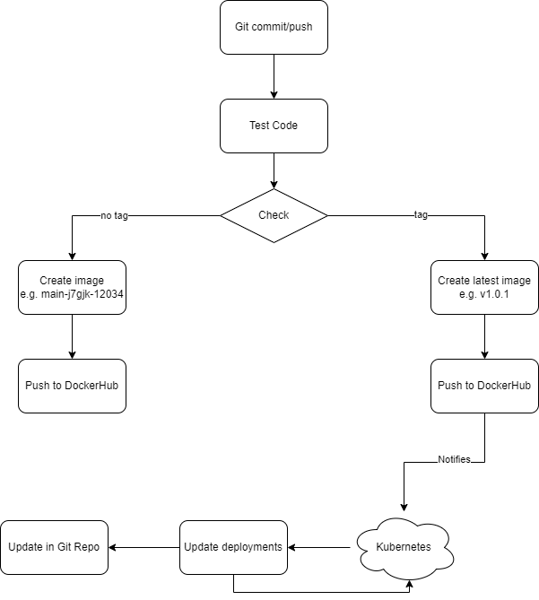

# Flux-CI-CD
Cloud Computing project using GitHub, Kubernetes and Flux for a CI/CD pipeline.

## Proposal

We plan to set up a CI/CD pipeline using GitHub, DockerHub, Kubernetes and Flux. This would include automatic testing and image generation, live deployment updates using these images, deployment manifest updates with new version numbers and deployment manifest synchronization between GitHub and the running cluster.




As shown, the image name would depend on whether a tag was used or not. The kubernetes cluster would only update to version with the same major version and ignore all non semver named images, i.e. main-j7gjk-12034 would be ingored.

As a basis we would use the deployment demo presented in the lecture. We would update the CI pipeline to produce the naming discussed above. We would then add [Flux image updates](https://fluxcd.io/flux/guides/image-update/).

### Demo

For demo purposes, we could either create a new repository and show all steps involved, or use an existing repository to demonstrate the (push tag -> generate image -> update manifests -> update deployments) pipeline.

### Work split

As this project seems like a small undertaking we would do this with 2 people instead of 3.

| Member      | Tasks |
| ----------- | ----------- |
| Christoph Pfleger | Create Proposal (find resources, check feasibility, design illustrations), Adapting CI pipeline |
| Luis Nachtigal | Add image updates (to Kubernetes cluster and GitHub manifests) |

## Setup

Increase nodes to 2, otherwise it won't run.

### 1. Create Flux Files

```
set GITHUB_TOKEN=
set GITHUB_USER=

flux bootstrap github --components-extra=image-reflector-controller,image-automation-controller --owner=%GITHUB_USER% --repository=Flux-CI-CD --branch=main --path=cluster --interval=1m0s --read-write-key --personal

kubectl get events -n flux-system --field-selector type=Warning
```

### 2. Add automatic image updates

```
flux create image repository demo --image=hub.docker.com/repository/docker/chripp/app --interval=1m0s --export > ./cluster/app-registry.yaml
```


```
flux create image policy demo --image-ref=demo --select-semver=^v1.0.0 --export > ./cluster/demo-policy.yaml
```

add to cluster/deployment.yml
```
# {"$imagepolicy": "flux-system:demo"}
```

```
flux create image update flux-system --git-repo-ref=Flux-CI-CD --git-repo-path="./cluster" --checkout-branch=main --push-branch=main --author-name=fluxcdbot --author-email=fluxcdbot@users.noreply.github.com --commit-template="{{range .Updated.Images}}{{println .}}{{end}}" --interval=1m0s --export > ./cluster/demo-automation.yaml
```

### 3. Add Github Action

Move setup/CI.yml to .github/workflows/


## Remove

```
flux uninstall
kubectl delete deployment demo
```